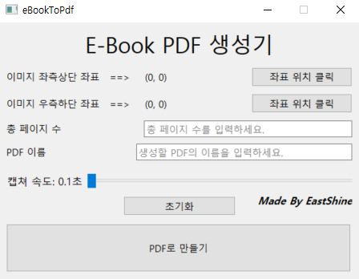

# eBookToPdf
E-Book PDF 추출 프로그램  
제작 과정 : https://eastshine12.tistory.com/55
   

# 프로그램 화면

   

# 실행파일 위치
eBookToPdf/dist/ebook_to_pdf.exe
   

# 사용법
1. '좌표 위치 클릭' 버튼 클릭 후 캡처할 영역의 좌측상단, 우측하단 좌표를 구한다.
2. 총 페이지 수와 생성할 PDF 이름을 작성한다.
3. 다음 페이지를 넘겨보며 화면이 완전히 랜더링되는 시간을 참고하여 캡처 속도를 조절한다.
4. PDF로 만들기 클릭!
5. 캡처 이미지가 많아지면, PDF 변환 시간이 길어질 수 있으므로 잠시 기다린다.
6. 'PDF 변환 완료!'라는 문구가 뜨면 PDF 생성이 완료된 것이다.
7. PDF 파일은 실행 파일과 같은 경로에 생성된다.
   

# 사용 시 유의사항
1. 해당 프로그램은 windows 전용 app이다.
2. 이미지 좌표 영역이 뷰어 영역을 벗어나면 안된다.
3. 반드시 키보드 오른쪽 방향키를 통해 다음 페이지 전환이 되어야 한다.
4. 페이지 수가 많을 경우 PDF 용량이 꽤 되므로 HDD 용량이 여유가 있어야 한다.
5. PDF 재생성 오류 시 프로그램을 재실행한다.
