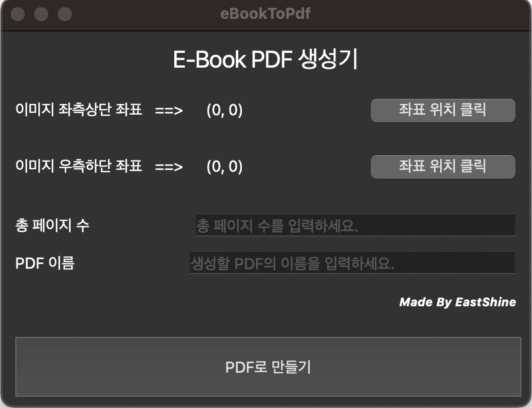

# eBookToPdf
E-Book PDF 추출 프로그램
   

# 프로그램 화면

   

# 사용법
1. '좌표 위치 클릭' 버튼 클릭 후 캡처할 영역의 좌측상단, 우측하단 좌표를 구한다.
2. 총 페이지 수와 생성할 PDF 이름을 작성한다.
3. PDF로 만들기 클릭!
   

# 사용 시 유의사항
1. 해당 프로그램은 mac 전용 app이다.
2. 이미지 좌표 영역이 뷰어 영역을 벗어나면 안된다.
3. 키보드 오른쪽 방향키를 통해 다음 페이지 전환이 되어야 한다.
4. 페이지 수가 많을 경우 PDF 용량이 꽤 되므로 HDD 용량이 여유가 있어야 한다.
